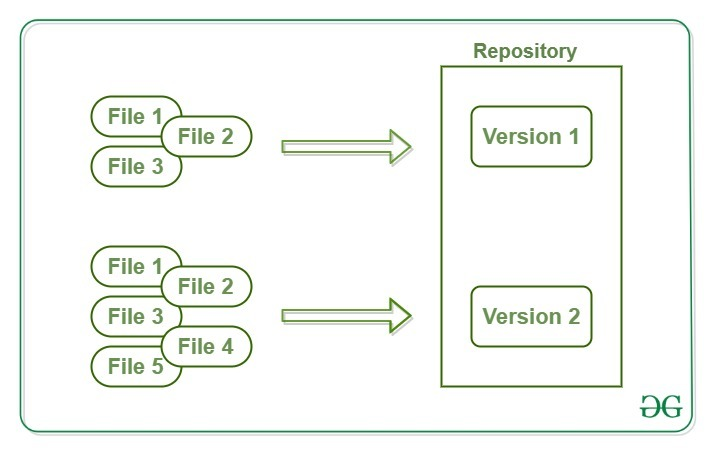
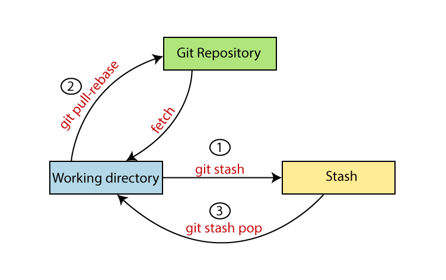

## Story

Imagine you’re a student named Ahmed, starting your first software project. You’ve heard that “Git” is essential for developers, but you’re not sure why. Let’s follow Ahmed’s story as He learns Git’s most common use cases, step by step.

---

## **Ahmed’s Git Adventure: From Newbie to Confident User**

### **1. Setting Up Git**

```bash
git --version
```

He sees the version number, confirming Git is ready to use.

Next, He configures her name and email-so everyone knows who made each change:

```bash
git config --global user.name "Ahmed Student"
git config --global user.email "Ahmed@example.com"
```


---

### **2. Starting Her First Project**

Ahmed creates a new project folder for her website:

```bash
mkdir my-website
cd my-website
```

He initializes Git in this folder:

```bash
git init
```

Now, Git will track changes in this directory.

---

### **3. Tracking Changes**

Ahmed adds a file called `index.html` and writes some HTML code. He checks what’s changed:

```bash
git status
```

Git tells her the file is “untracked.” He adds it to Git’s tracking:

```bash
git add index.html
```


Then, He saves the change with a commit:

```bash
git commit -m "Add homepage"
```

Now, her project’s history has its first entry.

---

### **4. Making More Changes**

Ahmed edits `index.html` and adds a new file, `about.html`. He checks the status again:

```bash
git status
```

He adds all changes at once:

```bash
git add .
git commit -m "Update homepage and add About page"
```


---

### **5. Oops! Fixing Mistakes**

Ahmed accidentally deletes some text. He wants to undo her changes:

```bash
 git restore .
```

Her file goes back to the last committed version.

---

### **6. Branching Out**

Ahmed wants to try a new design without breaking her main site. He creates a branch:

```bash
git branch new-design
git checkout new-design
```

He makes changes, commits them, and then switches back:

```bash
git checkout main
```


---

### **7. Merging Work**

Happy with her new design, Ahmed merges it into the main branch:

```bash
git merge new-design
```

Now, her main site has the new features.

---

### **8. Collaborating with Others**

Ahmed wants to share her project on GitHub. He creates a repository online, then connects her local project:

```bash
git remote add origin https://github.com/Ahmed/my-website.git
git push -u origin main

```


### ***9 You’re downloading the latest updates from https://github.com/yourname/yourrepo.git (which you’ve named origin), and Git will update a hidden pointer called origin/main.

```bash 
git pull  vs git fetch 

```

Now, her code is online. He can collaborate with friends, who can clone the repository, make changes, and send them back using pull requests[^4][^5].

```bash
git stash list
```


She can view all the stashes she’s made, each with a unique identifier[^1][^3][^9].
4. **Bring Back Her Stashed Work**

```bash
git stash pop
```

This command re-applies the most recent stash and removes it from the stash list. If she wants to keep the stash for later, she can use:

```bash
git stash apply
```

which reapplies the stash but keeps it in the list[^1][^3][^9].
5. **Stash With a Description**

```bash
git stash push -m "WIP: new homepage design"
```

Adding a message helps Sara remember what each stash was for[^1][^6][^13].
6. **Stash Only Certain Files**

```bash
git stash push index.html
```

Or, to interactively choose changes to stash:

```bash
git stash -p
```

This lets Sara pick specific changes (hunks) to stash[^1][^6].
7. **Drop or Clear Stashes**
- Remove a specific stash:

```bash
git stash drop stash@{0}
```

    - Remove all stashes:
 ```bash
git stash clear
```


# Git Local to Remote Lab

**Objective:** Learn the essential steps for using Git from your local machine to a remote repository.

---

## 1. Initialize a Local Repository
- Create a new folder for your project.  
  *Hint:* Use `mkdir` and `cd` to make and enter the folder.
- Initialize Git in this folder:  
  ```bash
  git init
  ```

## 2. Add and Commit Files Locally
- Create a file (for example, `README.md`).
- Add the file to Git:  
  ```bash
  git add README.md
  ```
- Commit your changes:  
  ```bash
  git commit -m "Initial commit"
  ```

## 3. Create a Remote Repository
- Go to GitHub (or GitLab/Bitbucket) and create a new, empty repository.
- Copy the repository URL (e.g., `https://github.com/yourusername/my-project.git`).

## 4. Link Local Repository to Remote
- Add the remote repository to your local repo:  
  ```bash
  git remote add origin https://github.com/yourusername/my-project.git
  ```
  *Hint:* Replace the URL with your own remote repo URL.
- Check your remote is set up:  
  ```bash
  git remote -v
  ```

## 5. Push Local Commits to Remote
- Push your commits to the remote repository:  
  ```bash
  git push -u origin main
  ```
  *Hint:* If your branch is called `master`, use that instead of `main`.

## 6. Create and Push a New Branch
- Create and switch to a new branch:  
  ```bash
  git checkout -b feature-branch
  ```
- Make a change and commit it.
- Push the new branch to the remote:  
  ```bash
  git push -u origin feature-branch
  ```

## 7. Pull and Fetch Updates from Remote
- Pull the latest changes from the main branch:  
  ```bash
  git pull origin main
  ```
- Fetch changes without merging:  
  ```bash
  git fetch origin
  ```

---

## Questions

1. **What does `git remote add origin <url>` do?**
2. **What is the difference between `git push` and `git pull`?**
3. **How do you publish a new branch to the remote repository?**
4. **Why do we use `git fetch`?**
5. **What command shows your current remotes?**

---

## Bonus

Try cloning your remote repository into a new folder using:

```bash
git clone https://github.com/yourusername/my-project.git
```
